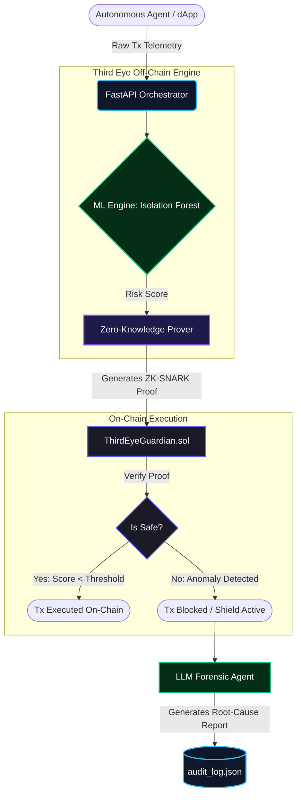
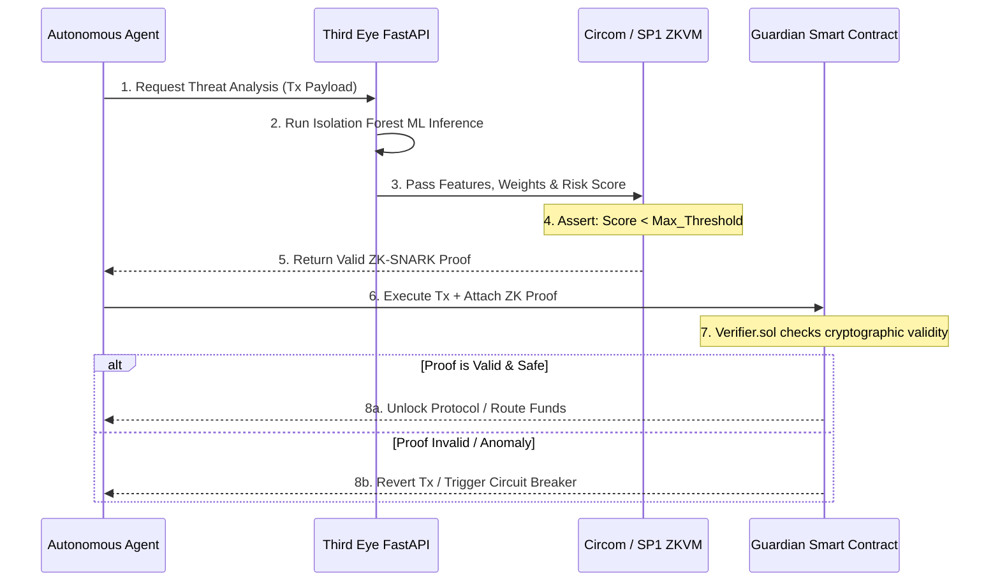

# Third Eye — Autonomous On-Chain Immunity System

Built by Team **Vmax** (Aditya Gavane, Gaurav Jain, Nishad Kulkarni)

\---

## What is Third Eye?

Third Eye is a real-time, autonomous Web3 threat-detection and response system.
It ingests live on-chain transaction data, runs ML-based anomaly detection, generates
AI forensic reports, and — critically — **automatically blacklists malicious wallets**
on a Guardian smart contract deployed on Base Sepolia. Protocols can integrate with
that contract to shield themselves pre-emptively.

Think of it as an immune system for DeFi: detect → analyse → respond, all without
human intervention.

---

## Architecture

```
┌────────────────────────────────────────────────────────────────┐
│                          Third Eye                             │
│                                                                │
│   Etherscan V2 ──► Neo4j Graph ──► ML Engine (IsoForest)      │
│                                          │                     │
│                                          ▼                     │
│   Frontend Galaxy UI ◄─── FastAPI ───► Groq LLM Report        │
│                               │                                │
│                               ▼                                │
│                    Guardian Contract (Base Sepolia)            │
│                    blacklistWallet(addr, riskScore, reason)    │
└────────────────────────────────────────────────────────────────┘
```

### System Flow Diagram



### Protocol Interaction Sequence



### Data Flow

1. **Ingest** — BFS-crawl from known attacker wallets via Etherscan API V2. Flash loans, ERC-20 transfers, and normal txns are all captured.
2. **Graph** — Every wallet becomes a `:Wallet` node in Neo4j. Transactions become `:SENT_TO` edges. This gives topology for cycle detection and centrality metrics.
3. **Score** — An Isolation Forest model (contamination = 0.05) evaluates each wallet on volume, graph metrics, and behavioural signals and outputs a risk score 0.0–1.0.
4. **Report** — Wallets above the threshold trigger a Groq-powered forensic report with executive summary, threat narrative, and recommended actions.
5. **Shield** — The backend signs a transaction with `OPERATOR_PRIVATE_KEY` and calls `blacklistWallet()` on the Guardian contract, permanently flagging the address on-chain.

---

## Tech Stack

| Layer | Technology |
|---|---|
| **Backend API** | Python · FastAPI · Uvicorn |
| **Task Queue** | Celery · Redis |
| **Database** | Neo4j (local `bolt://localhost:7687`) |
| **ML Engine** | scikit-learn Isolation Forest · hummingbird-ml · ONNX |
| **ZK Layer** | SP1 (Succinct) · EZKL |
| **LLM Reports** | Groq API (Llama 3) |
| **Smart Contract** | Solidity · Base Sepolia |
| **Frontend** | React 18 · TypeScript · Vite · Three.js (3-D Galaxy) |
| **Auth** | Privy (embedded wallets) |
| **Blockchain SDK** | web3.py · eth-account |
| **Data Source** | Etherscan API V2 |

---

## Repository Structure

```
third_eye/
├── backend/
│   ├── main.py               # FastAPI app — all routes
│   ├── database.py           # Neo4j async driver setup
│   ├── tasks.py              # Celery background tasks
│   ├── core/
│   │   ├── ml_engine.py      # Isolation Forest scorer
│   │   ├── etherscan.py      # Etherscan V2 client
│   │   ├── psi_engine.py     # PSI (Private Set Intersection) engine
│   │   └── audit.py          # On-chain audit logger
│   └── agent/
│       └── llm_engine.py     # Groq forensic report generator
├── frontend/
│   └── src/
│       ├── components/
│       │   ├── Galaxy3D.tsx          # Three.js force-graph visualization
│       │   ├── Sidebar.tsx           # Forensic investigation panel
│       │   ├── RightPanel.tsx        # Right details panel
│       │   └── ThreatActivityGraph.tsx
│       ├── hooks/
│       │   └── useShield.ts          # Guardian contract hook (viem)
│       ├── context/
│       │   └── AuthContext.tsx       # Privy auth wrapper
│       └── pages/
│           └── Dashboard.tsx         # Main layout
├── contracts/
│   └── ThirdEyeGuardian.sol    # Blacklist contract (Base Sepolia)
├── scripts/
│   ├── seed_real.py            # BFS crawl seeder (Etherscan → Neo4j)
│   └── seed_galaxy.py          # Demo galaxy data seeder
└── zk-ml/                      # SP1 zkML prover (Rust)
```

---

## API Reference

| Endpoint | Method | Description |
|---|---|---|
| `/api/graph/nodes` | `GET` | Graph data for the Galaxy UI (nodes + edges) |
| `/api/graph/flag` | `POST` | Flag a wallet in Neo4j |
| `/api/ingest/wallet` | `POST` | Live ingest via Etherscan, ML score, Neo4j upsert |
| `/api/forensic/report/{addr}` | `GET` | Groq LLM forensic threat report |
| `/api/shield/blacklist` | `POST` | Sign tx + call Guardian contract on Base Sepolia |
| `/api/simulate-exploit` | `POST` | Inject a demo attacker wallet for demos |
| `/api/docs` | `GET` | Swagger UI |

---

## Guardian Smart Contract

- **Network:** Base Sepolia (chain ID 84532)  
- **Address:** `0xd9145CCE52D386f254917e481eB44e9943F39138`  
- **Key function:** `blacklistWallet(address wallet, uint256 riskScore, string reason)`  
- The operator address (derived from `OPERATOR_PRIVATE_KEY`) must hold the `OPERATOR_ROLE`.

---

## Local Development Setup

### Prerequisites

| Tool | Version |
|---|---|
| Python | 3.10+ |
| Node.js | 18+ |
| Neo4j | 5.x (local instance) |
| Redis | 7.x |

### 1 — Clone & configure environment

```bash
git clone https://github.com/your-org/third_eye.git
cd third_eye
cp .env.example .env
# Fill in: GROQ_API_KEY, ETHERSCAN_API_KEY,
#           OPERATOR_PRIVATE_KEY, NEO4J_AUTH, VITE_PRIVY_APP_ID
```

### 2 — Backend

```bash
cd backend
python -m venv .venv

# Windows
.venv\Scripts\activate
# macOS / Linux
# source .venv/bin/activate

pip install -r requirements.txt
uvicorn main:app --reload --port 8000
```

- API: `http://localhost:8000`  
- Swagger UI: `http://localhost:8000/api/docs`

### 3 — Seed the graph (optional but recommended)

```bash
# Make sure Neo4j is running first
python scripts/seed_galaxy.py      # Fast demo data (~seconds)
# python scripts/seed_real.py      # Real Etherscan BFS crawl (minutes)
```

### 4 — Frontend

```bash
cd frontend
npm install
npm run dev
```

- Frontend: `http://localhost:5173`

### 5 — Celery worker (background ingestion)

```bash
# In a separate terminal with Redis running:
cd backend
celery -A tasks worker --loglevel=info
```

---

## Environment Variables

| Variable | Description |
|---|---|
| `ETHERSCAN_API_KEY` | Etherscan V2 API key |
| `GEMINI_API_KEY` | Google Gemini API key |
| `GROQ_API_KEY` | Groq API key (LLM forensic reports) |
| `NEO4J_URI` | Neo4j bolt URI (`bolt://localhost:7687`) |
| `NEO4J_AUTH` | `username/password` |
| `NEO4J_DATABASE` | Database name (`thirdeye-db`) |
| `REDIS_URL` | Redis connection URL |
| `CELERY_BROKER_URL` | Celery broker URL (same Redis) |
| `OPERATOR_PRIVATE_KEY` | Private key for Guardian contract operator |
| `GUARDIAN_CONTRACT_ADDRESS` | Deployed Guardian contract address |
| `WEB3_RPC_URL` | Base Sepolia RPC endpoint |
| `VITE_PRIVY_APP_ID` | Privy app ID (frontend wallet auth) |
| `PRIVY_APP_SECRET` | Privy app secret (backend) |
| `HMAC_SECRET_KEY` | 256-bit secret for internal route HMAC |
| `SP1_PROVER` | `network` / `local` / `mock` |
| `ZK_PROOF_ENABLED` | `true` / `false` |

---

## License

Part of the Nexus Hackathon project. All rights reserved by Team Vmax.
